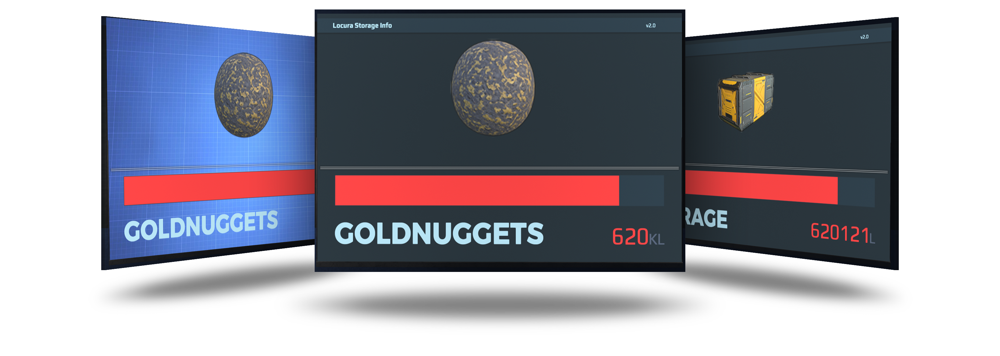
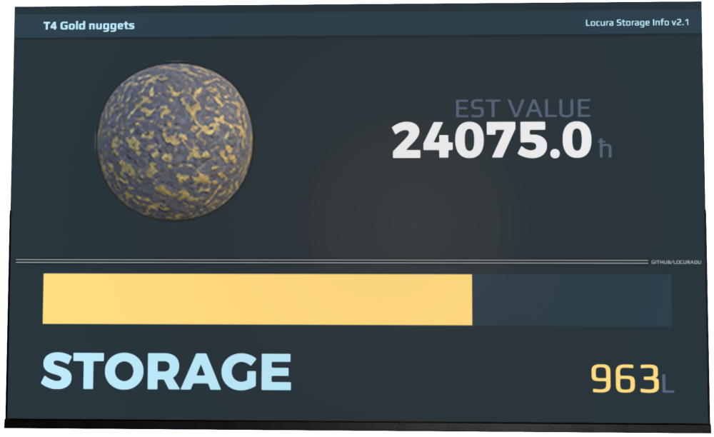
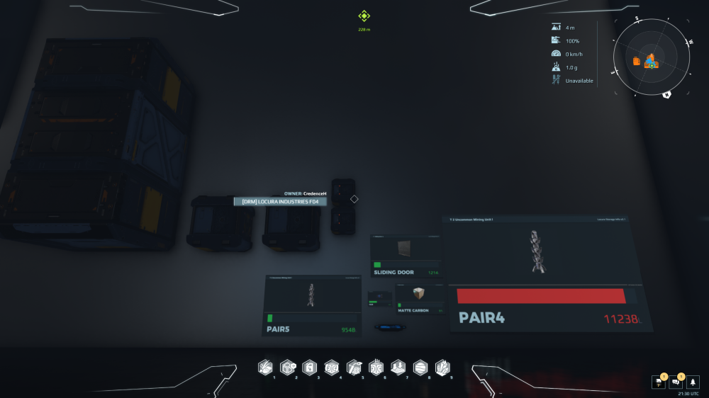

:heavy_exclamation_mark: | v2.0+ No Longer Contains Any HTML. No Need To Adjust Game Settings.
:---: | :---

# Information
 Display for single items in containers/hubs. Can also be used for multi item containers/hubs if you're not using the "Items Left" option. The script doesn't need to adhere to NQ's 30-second refresh rules and can be refreshed at any time. Great for uses like industrial, or even sales signs for shops. Many options for functions, and styles to make the plugin match your aesthetic. All in all an amazing easy to use script for all your container data needs. Now supports up to 5 diffrent screens, and containers all from one board.  

---

# Preview

| v2.1  | v2.2 |
| ------------- | ------------- |
|   |   |
| New options for v2.1| v2.2 brings support for 5 displays and 5 different containers all from one board |

# Installation / Documentation / Wiki

# Edit Code

# Screen And Sign Compatibility

# Ways To Help
- Contribute new code, or updating whats already here
- Donate for Dr Pepper funds at Venmo @terranbytes
- Join or start a discussion on the discussions tab

# Contacts
- Credence (Dual Universe)
- Credence#1983 (Discord)
- CredenceHamby (GitHub)

# Other
> **Note**
> - This was originally a fork from (https://github.com/brendonh).
> - Some aesthetic ideas from (https://github.com/Jericho1060)

> **Warning**
> This may or may not work with some screens or signs. Please check list above for compatibility.

> **Warning**
> Too many screen in an area will hurt game performance. The game will also start throttling back screen quality upon reaching a certain number of screens. Using Animations in screens will make this much worse. Only use a few animated screens in an area for best performance.
